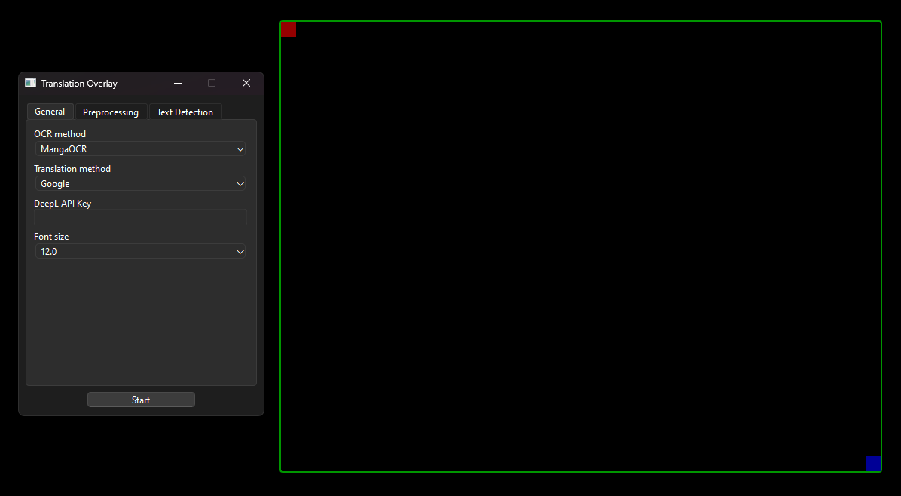
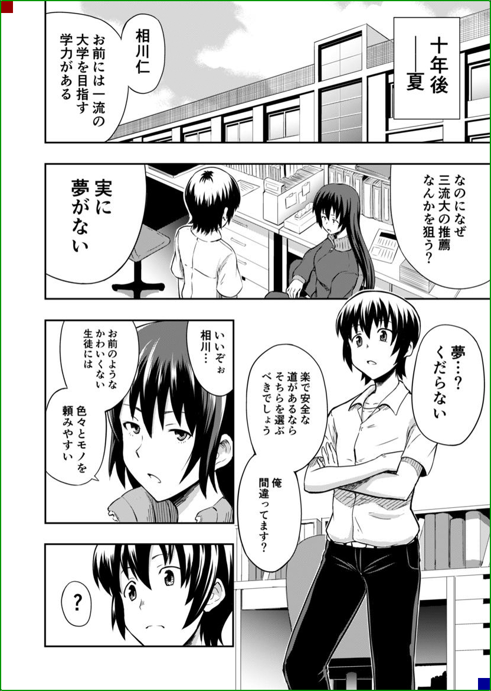
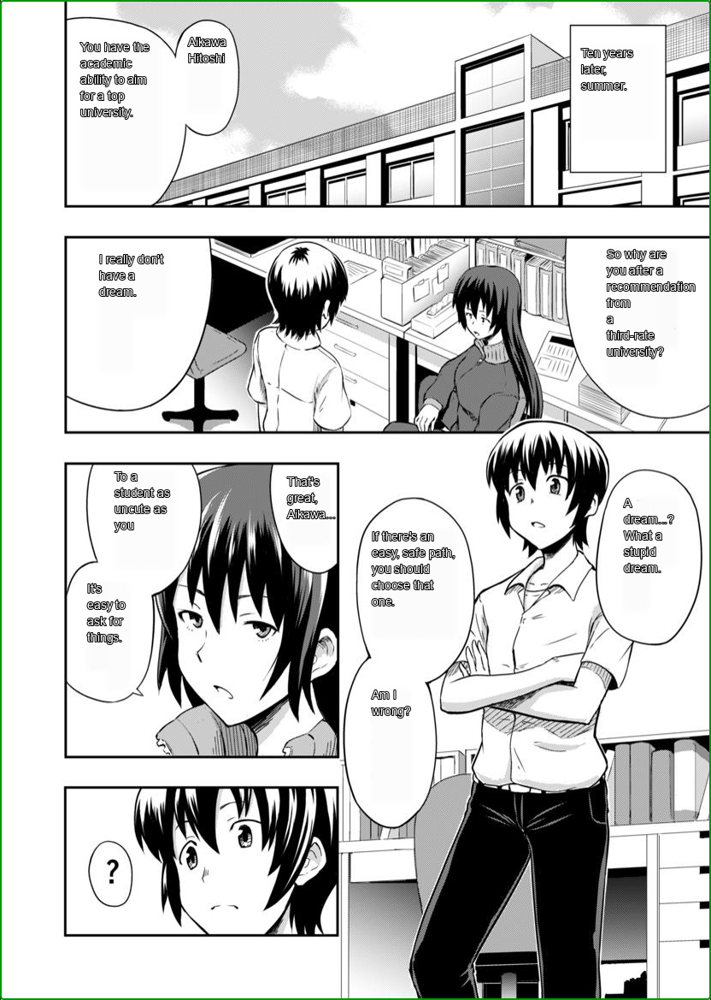
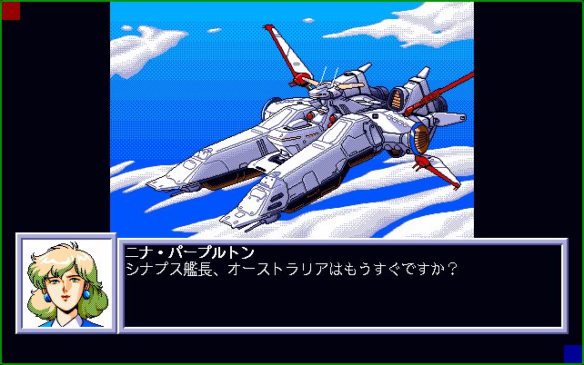
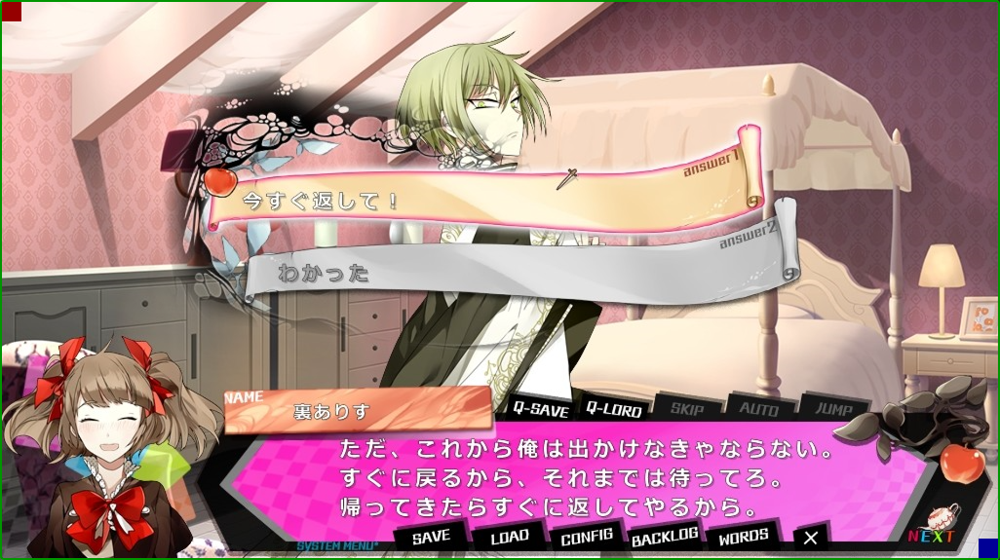
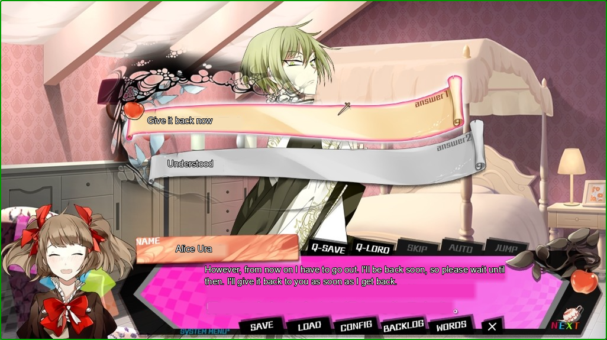

# JP to EN Translation Overlay
Application written in Python for reading text from area of the screen and overlaying a translation of it on top of original text.

If you like my project and/or want to check if I'm working on any other projects, consider checking out my [Patreon](https://patreon.com/Lemiru?utm_medium=unknown&utm_source=join_link&utm_campaign=creatorshare_creator&utm_content=copyLink).

## Requirements
- OS: Windows 10 Version 2004 or newer
- Python: 3.10 or newer
- GPU: any NVIDIA GPU compatible with CUDA Toolkit 11.8 (Optional)

>**Note**: Application might still work on platforms other than Windows, but they haven't been tested yet and there might be some platform specific issues.

## Setup
I recommend creating a Virtual Environment for this project.
Before installing dependencies from requirements.txt you should install [PyTorch](https://pytorch.org/get-started/locally/#start-locally) and [PaddlePaddle](https://www.paddlepaddle.org.cn/en/install/quick?docurl=/documentation/docs/en/develop/install/pip/windows-pip_en.html) libraries manually.

If you want to use it with NVIDIA GPU you'll have to install CUDA Toolkit.
>**Note**: Make sure that you are installing both libraries for the same CUDA Toolkit version. At the moment, the only version of CUDA Toolkit supported by both PyTorch and PaddlePaddle is 11.8.

After that you can install remaining dependencies from requirements.txt
```bash
pip install -r requirements.txt
```
## How to use
You can start the program by running main.py script
```bash
python main.py
```
>**Note**:If you are using the program for the first time, or you are switching to an OCR or translation method you haven't used yet, it might take longer for the program to load as it might need to download relevant models.

After starting the program there will appear an overlay window and a configuration window.



To adjust the overlay position you can drag the red square (top-left corner) to move it and blue square (bottom-right corner) to resize it.

In the "General" tab you can select a method for performing OCR (Optical Character Recognition) and translation of the detected text as well as picking the font size of displayed translation.

Currently supported OCR methods:
- MangaOCR (default, recommended in most cases)
- PaddleOCR (can be more accurate in reading horizontal text, not recommended to use for vertical text)

Currently supported translation methods:
- Google Translate
- DeepL
- Sugoi Offline Translation Model

In the "Preprocessing" tab you will find various options for processing the image before performing OCR, as well as button to show a preview of how the overlay area would be processed. 
For choosing the best settings I recommend starting by trying out translating with just resizing by 2 and applying slight gaussian blur. 
If the results are not satisfactory you can apply histogram equalization and/or one of binarization types (most commonly "InvertedWithNegC" will yield best results).
In order for binarization to work the best, the "blocks"(how wide of an area will be taken into consideration when calculating a pixel value) and "C"(used for adjusting a treshold for binarizing calculated pixel values) values need to be adjusted and checked.


In the "Text Detection" tab you can adjust values used for detecting text areas before performing OCR:

- Paragraph Detection (If set to "Horizontal" or "Vertical", the program will attempt to group detected areas into paragraphs, which might improve final result of translation)
- Text threshold (a threshold that controls how certain text detection model must be to classify area as text)
- Link threshold (a threshold that controls how certain text detection model must be to combine areas that are part of the same text)
- Low text (value that affects padding of detected text areas. The smaller the value, the more padding will it have)

>**Note**: Without any additional setup only Google Translate method will be available. For DeepL method to become available you must first provide an API key. In order to use Sugoi Model, you'll have to provide it yourself (exact process explained in sugoi.txt).


## Examples
Here are some examples of the translation results of the app with original image for comparison.

| original                      | translated                   |
|-------------------------------|------------------------------|
|  |  |
|  |  |
|  |  |


## Known issues
- When using PaddleOCR, the program might in specific cases incorrectly determine the order of detected text.
- When used on media with vertical text, the program might in some cases struggle to correctly detect whole blocks of text. In order to work around this problem it is recommended to use significantly lower "Link Threshold" and "Low Text" values.
